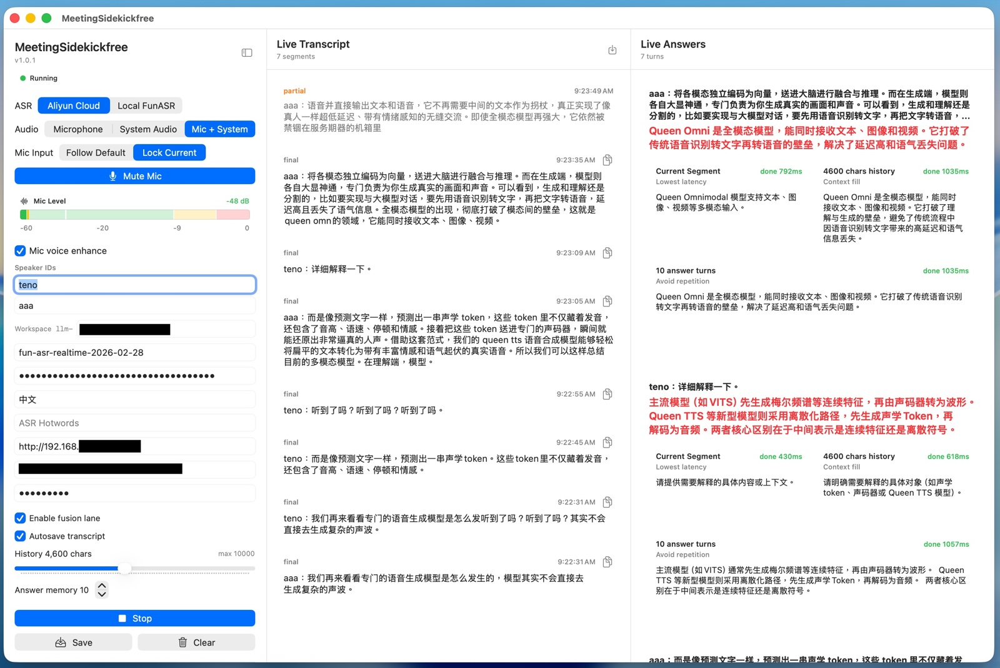

# MeetingSidekickfree



MeetingSidekickfree is a macOS ARM64 realtime meeting sidekick for listening to microphone and system audio, sending speech to streaming ASR, and using an OpenAI-compatible LLM endpoint to produce short live answers or directly useful context.

## Supported Platform

MeetingSidekickfree currently supports **macOS only**. It is developed and packaged for Apple Silicon Macs.

Required permissions:

- Microphone permission for microphone capture
- Screen Recording permission for system audio capture

## Features

- Microphone, system audio, or simultaneous `Mic + System` capture
- Separate ASR WebSocket sessions for microphone and system audio
- Optional microphone voice enhancement before ASR
- Aliyun Bailian/FunASR realtime WebSocket backend
- Local FunASR realtime WebSocket backend
- OpenAI-compatible vLLM chat completions
- Concurrent low-latency answer lanes
- API log panel and transcript export/autosave

## Configuration

App settings are saved in macOS UserDefaults under the app bundle identifier:

```bash
defaults read local.meetingsidekickfree.client MeetingSidekickfree.AppConfig.v1
```

## ASR Backends

### Aliyun Cloud

The Aliyun backend requires:

- Workspace ID, shown in the UI as `llm-` plus your workspace suffix
- API key
- Model ID

New Aliyun Bailian users can register and create an API key here:
[https://bailian.console.aliyun.com/cn-beijing](https://bailian.console.aliyun.com/cn-beijing?userCode=crft2gd6&tab=model#/api-key)

New users can use `fun-asr-realtime` free for 10 hours.

The default model ID is:

```text
fun-asr-realtime
```

If the model field is left blank, the app uses that default model ID. The WebSocket endpoint is built from the workspace ID:

```text
wss://<workspace-id>.cn-beijing.maas.aliyuncs.com/api-ws/v1/inference
```

The WebSocket request sends:

```text
Authorization: Bearer <api_key>
```

`ASR Hotwords` accepts space-separated Chinese or English words. Other characters are removed by the UI. For Aliyun Cloud, the app creates a temporary hotword vocabulary with default `weight: 4`, waits until it is ready, and passes its `vocabulary_id` in the realtime `run-task` parameters. The temporary vocabulary is deleted when the ASR connection closes.

### Local FunASR

The local backend defaults to:

```text
ws://127.0.0.1:10095
```

Expected protocol:

- Client sends `START`
- Client optionally sends `LANGUAGE:<value>`
- Client optionally sends `HOTWORDS:<value>`
- Client sends binary `pcm_s16le`, 16 kHz, mono audio frames
- Client sends `STOP` when the session ends
- Server returns cumulative snapshots of locked `sentences[]`, not per-response deltas
- Client upserts locked sentences by `(start, end, text)` and ignores unchanged snapshot entries
- Server returns a replaceable `partial`; the client never promotes it to final on a timer
- `is_final` becomes `true` only after `STOP` and ends the current session

For Local FunASR, `ASR Hotwords` is normalized the same way and sent as one space-separated `HOTWORDS:<value>` control message.

## vLLM / OpenAI-Compatible Backend

The LLM backend uses an OpenAI-compatible `/chat/completions` endpoint. Requests are short, non-streaming completions. When the configured model name contains `qwen`, the app sends:

```json
{
  "chat_template_kwargs": {
    "enable_thinking": false
  }
}
```

For other model names, `chat_template_kwargs` is omitted to stay compatible with non-Qwen OpenAI-compatible servers. If the model field is blank, it is also omitted.

## Build

Build the executable:

```bash
swift build
```

Build a release executable:

```bash
swift build --disable-sandbox -c release
```

## Package App

Create a local `.app` bundle and distributable `.dmg`:

```bash
./Scripts/package-app.sh
open Build/MeetingSidekickfree-<git-sha>-macos-arm64.dmg
```

The package script:

- Builds the release binary
- Creates `Build/MeetingSidekickfree-<git-sha>.app`
- Creates `Build/MeetingSidekickfree-<git-sha>-macos-arm64.dmg`
- Copies `Resources/Info.plist`
- Sets the bundle display name to include the git short SHA
- Signs the app with ad-hoc code signing

If macOS already has an older ad-hoc build in Screen Recording permissions, remove it, launch the newly packaged app once, grant permission, then restart the app.
